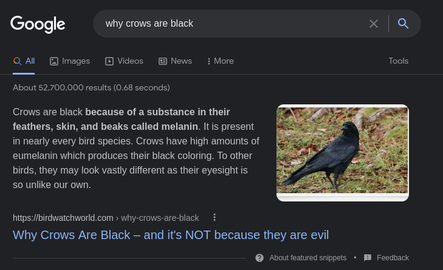

<!-- START doctoc generated TOC please keep comment here to allow auto update -->
<!-- DON'T EDIT THIS SECTION, INSTEAD RE-RUN doctoc TO UPDATE -->
**Table of Contents**

- [SEO of Today, Tomorrow and Beyond](#seo-of-today-tomorrow-and-beyond)
  - [Core Web Vitals](#core-web-vitals)
    - [Real-World Experience Metrics](#real-world-experience-metrics)
    - [Impact](#impact)
    - [Google Lighthouse](#google-lighthouse)
  - [EAT & YMYL (Your Money, Your Life)](#eat--ymyl-your-money-your-life)
    - [YMYL](#ymyl)
    - [E.A.T](#eat)
      - [Expertise](#expertise)
      - [Authority](#authority)
      - [Trust](#trust)
    - [Google Evaluations](#google-evaluations)
  - [Featured Snippets and Rich Snippets](#featured-snippets-and-rich-snippets)
    - [Featured Snippets](#featured-snippets)
      - [Pros](#pros)
      - [Cons](#cons)
      - [Impacts of CTR](#impacts-of-ctr)
      - [Click and traffic](#click-and-traffic)
      - [Though Leadership and Branding](#though-leadership-and-branding)
    - [Rich Snippets/Results](#rich-snippetsresults)
      - [Schema](#schema)
  - [BERT (2019)](#bert-2019)
    - [Specifics](#specifics)
    - [Optimizing for BERT](#optimizing-for-bert)
    - [Impacts](#impacts)
  - [Evolution of Keyword Optimization](#evolution-of-keyword-optimization)
  - [Strengthening Your Keyword Strategy](#strengthening-your-keyword-strategy)
    - [Topic Association](#topic-association)
  - [How Does Branding Influence Website Rank?](#how-does-branding-influence-website-rank)
    - [Branding](#branding)
    - [How identify Brand?](#how-identify-brand)
    - [How to do SEO for a Brand?](#how-to-do-seo-for-a-brand)

<!-- END doctoc generated TOC please keep comment here to allow auto update -->

# SEO of Today, Tomorrow and Beyond

## Core Web Vitals

  "Google ranking factors that revolve around the user experience while on your site."

### Real-World Experience Metrics

- Page load time
- Sit stability
- Site security
- Intrusive interstitials (Pop-ups)

### Impact

- Ranking on mobile and desktop
- Rank in Google's top stories
- Must meet minimum score

### Google Lighthouse

- Diagnose issues
- Recommend fixes

## EAT & YMYL (Your Money, Your Life)

### YMYL

  "Effects sites that affect someone's health, wealth, happiness, safety, or financial stability."

- Any site allowing a customer to make a transaction or pay bills
- Financial: investment advice, retirement/estate planning, tax advice, etc.
- Medical: dieting tips, mental health, nutrition, health conditions, drugs, etc.
- Legal: legal advice, divorce/marriages, wills, child custody, etc.
- Official information: government information, policies, disaster preparedness, etc.
- Other examples: child adoption, real estate, car safety, etc.

### E.A.T

- Expertise
- Authority
- Trust

> Are you and your website authors experts on the subject?
> Is the author or website an authority on the topic presented?
> How trustworthy is the content that is presented, and the website itself?

#### Expertise

- Publishing high quality content
- About page addressing your credentials
- Author bio pages
- Links to media mentions

#### Authority

- Links and citations from press and media
- speaking gigs
- Often shareable content
- Branded search volume
- Wikipedia pages and mentions

#### Trust

- Clear and accurate contact information
- Clear about policies, shipping info, terms and conditions
- HTTPS is extra secure
- General sentiment - positive or negative
- Look at reviews
- Register with the BBB (Better Business Bureau; specific to US only)

### Google Evaluations

- Human quality raters for EAT review
- Manually review your site to determine your EAT score

## Featured Snippets and Rich Snippets

### Featured Snippets

- Position "0"
- Snippets for voice search questions

#### Pros

- Good branding 
- Good if you want to obtain the voice search results

#### Cons

- You get less shelf-space for page one ranking
- The result may answer a query and prevent them from clicking to your website

 

#### Impacts of CTR

- Query type
- Target audience behavior
- Specific industry
- Type of featured Snippets
- Your search position

#### Click and traffic

- Optimize for the featured Snippets?
- Determine if the queries have a featured snippet
- Featured snippets are growing

#### Though Leadership and Branding

- Ideal
- Position yourself as a thought leader
- Not intended to drive people to your site

### Rich Snippets/Results

- Having clear distinction from others
- Have
  
  + Star ratings
  + Data
  + Clickable navigation

#### Schema

- A markup to your existing content around specific data
- Visually appealing in search results
- Availability

  + Schema for everything
  + Visit schema.org
  + Obtain rich results
  + Integrate into your website's code
  + Use JSON

## BERT (2019)

- Bidirectional Encoder Representations from Transformers
- Neural Network technique
- One of the biggest updates
- Impacts 1 in 10 search queries
- Helps Google understand human language better
- Determine context of search query

### Specifics

- Now pays attention to context words like

  + To
  + With
  + by
  + AT
  + On

- Sentiments of phrases and discussions
- Sentence is positive, negative, sarcastic, etc.

### Optimizing for BERT

- Well written articles
- Write in the voice, language, education level for target audience
- Articles should clearly explain what you're trying to solve or teach them
- Include relevant details

### Impacts

- Social listening tools
- Chat bots respond and interact with users

## Evolution of Keyword Optimization

- Algorithms are constantly updated to help remove websites with no user value
- Algorithms analyze documents to determine usefulness
- Topic modeling allows search engines to gauge relevance
- Algorithms use topic association AND semantic relationships between keywords
- Knowledge of topic association will help in crafting engaging content
- Algorithm updates bring new SEO challenges
- SEO has become complex and difficult
- No longer enough for SEOs to adhere to simple checklists
- Require more holistic approach with a knowledge of relevant signals
- Optimized content now relates to overall page concept not keywords
- topic association and semantic analysis allow for better content
- SEOs must deal with the shifting methods of keyword research and optimization

## Strengthening Your Keyword Strategy

### Topic Association

  "used by search engines to determine relevancy and trustworthiness"

- Search engines analyze contextual meaning to find relevance to topic/theme
- Page should contain keywords relevant to focus keyword, rather than repeating the focus keyword, Examples;

  + Winemaking: wine, vineyard, wine growing, wine production
  + Support: learn, instructors, students, tuition
  + certification: course, class, lecture, program, certificate

- Long-tail optimization

  + Where can I learn to make wine?
  + How do I get a certificate in winemaking?

- Focus keyword can be broken up into synonyms and other elements
- What other ways can I describe the theme?
- What other words would be relevant?
- What other words support the page topic?
- Page should contain supporting keywords
- Having content that has a cohesive theme results in "long tail keywords"
  + Long-tail keywords are longer words or phrases - difficult to predict but very targeted
- Algorithm was updated to check for relevancy and semantic relationships
  + Semantic analysis looks at how words are related
  + After Hummingbird, semantic and related results were even clearer

## How Does Branding Influence Website Rank?

### Branding

- Important to marketing strategy
- Can support and boost SEO efforts
- Brand is becoming more Important to Google's relevancy Algorithm
- SEOs must consider which factors separate brands from untrustworthy shops or spam sites

### How to identify a Brand?

- Active social media presence
- contact information
  + Address
  + Phone number
  + Email
  + Contact form
- Established history (domain registration time) and visible intent to continue doing business
- Receive search volume for their specific brand
- More mentions around the web, including social media
- Bidding on paid keywords for brand names is a strong signal
- Brand keywords drive better conversions in paid search

### How to do SEO for a Brand Recognition?

- Consider which external quality signals improve legitimacy
- Value leads to quality signals
  + Social presence
  + Contact info
  + Established history

- Branding and SEO are not mutually exclusive, two strong tactics that work well together
- Large part of SEO involves raising brand awareness
- Clear, value focused goals
- Help grow your brand
  + Create great content
  + Develop social presence
  + Acquire links
  + Helps to cultivate branded search
